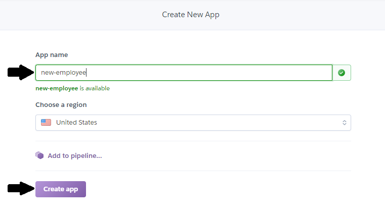
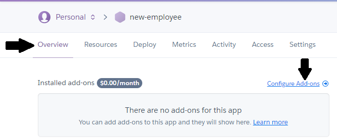
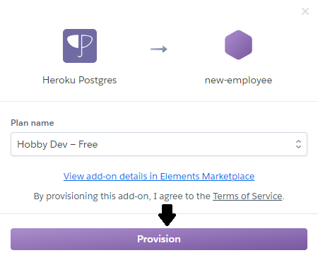
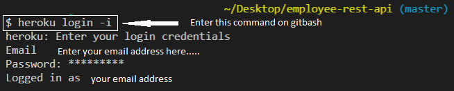
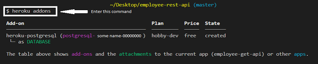
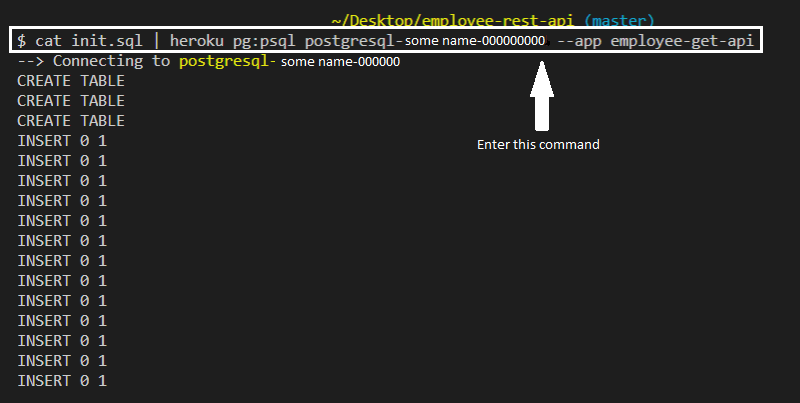
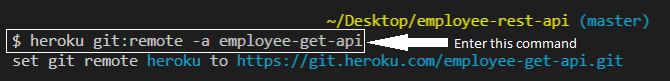
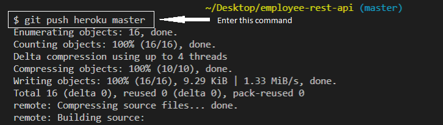

# employee-rest-api

## This is an api developed using Nodejs, ExpressJs, Postgre database and deployed on Heroku cloud platform.

### Table of contents
1. [ env ](#env)
2. [ git-ignore ](#gitignore)
3. [ Procfile ](#procfile)
4. [ config.js ](#config)
5. [ index.js ](#index)
6. [ init.sql ](#init)
7. [ steps to deploy on Heroku ](#steps)
8. [ references ](#references)

## 1. why env file is required

>This file includes all the environment variables needed for the api to run on your local machine.
>When deployed on Heroku's cloud platform these variable's are no lomger in use.
>Heroku provides its own database url when the project is deployed.

> Hence we have written this line of code in config.js file:
>><code>connectionString: isProduction ? process.env.DATABASE_URL : connectionString</code>

> This infers that when you are in production use url provided by heroku and when you are on dev just use the url created using env variables.

>Note: Including this file is completely optional but, it is a good programming practice to create a separate file for variables.

## 2. why gitignore file is required

>This file includes all the folders and files that are not to be included in the git repository i.e while pushing the code to your repo theses files are automatically ignored.

## 3. why Procfile file is required

>In order to run your project on the local machine you, write the command:
>><code>node index.js</code>

>In the same way Heroku also needs to know the starting point of your project. So, it uses this Procfile to run your application.

## 4. what is config.js file

>This file contains the database connection code.

>It establishes the connection and returns the connection pool.

## 5. what is index.js file

>Thiis is the starting point of your application.

## 6. why is init.sql file required

>This file is required to initialize the postgre db on production environment.
>It contains the schema to create the database.

## 7. Steps to deploy the api on Heroku

1. you must already have an account created on heroku.
2. you need to have git bash installed in your local system.
3. you need to now install the Heroku-cli for deployment.
4. after installing Heroku-cli check your system's environment variables whether the cli path has been added or not.
5. now first we will deploy the code and the we will create the database on Heroku.

    * * *  
    1. go to Heroku's website and click on create new app.
    * * *  
    
    * * *  
    2. now enter a unique name for your application and then click on create.
    * * *  
    
    * * *  
    3. now select overview tab and click on configure addons
    * * *  
    
    * * *  
    4. now enter the name of addon for Postgres i.e Heroku postgres.
    * * *  
    
    * * *  
    5. click on provision and you are done on gui side.
    * * *  
    
    * * *
    
6. now on git bash you need to type the following commands:
    * * *
    1. first you need to login to Heroku from Heroku's cli.
    * * *
    
    * * *
    2. then you need to get the name of the database instance to initialize the database using the following command.
    * * *
    
    * * *
    3. initialize the database.
    * * *
    
    * * *
    4. now type following command.
    * * *
    
    * * *
    5. finally push the code to the Heroku's master
    * * *
    
    * * *
7. you have successfully deployed your api to the Heroku's cloud platform and now you can use the URL to use the api with front-end.

## 8. references

1. https://www.taniarascia.com/node-express-postgresql-heroku/
2. https://www.youtube.com/watch?v=MxfxiR8TVNU
3. https://dev.to/lawrence_eagles/causes-of-heroku-h10-app-crashed-error-and-how-to-solve-them-3jnl
4. http://mfikri.com/en/blog/nodejs-restful-api-mysql
5. https://stackoverflow.com/questions/45088006/nodejs-error-self-signed-certificate-in-certificate-chain/45088585
6. https://stackoverflow.com/questions/13011881/node-js-simple-app-not-working-on-heroku
